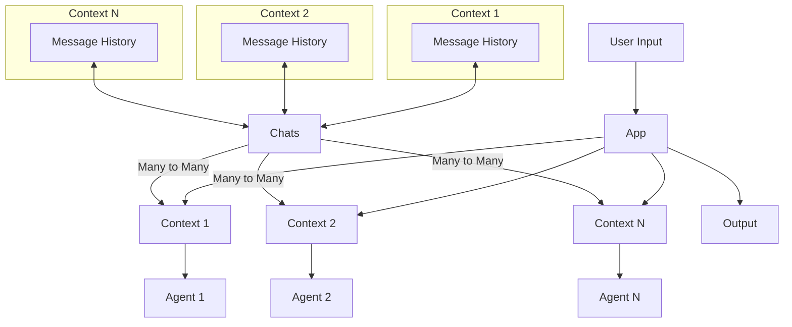

# Zap ⚡️

Supercharge your terminal with AI-powered coding workflows

Zap ⚡️ is a powerful AI coding assistant that enables developers to run and automate coding workflows directly from the
command line. It features agentic capabilities, allowing management of multiple AI agents simultaneously.

## Table of Contents

- [Installation](#installation)
- [Configuration](#configuration)
- [Key Features](#key-features)
- [Usage Examples](#usage-examples)
- [Customizing Agents](#customizing-agents)
- [Architecture](#architecture)
- [Contributing](#contributing)
- [License](#license)

## Installation

Prerequisites:

- Python 3.11+
- Poetry

To install Zap ⚡️, follow these steps:

1. Clone the repository:
   ```bash
   git clone https://github.com/your-repo/zap.git
   cd zap
   ```

2. Install dependencies using Poetry:
   ```bash
   poetry install
   ```

3. Activate the Poetry shell:
   ```bash
   poetry shell
   ```

4. Run Zap:
   ```bash
   python -m zap
   ```

## Configuration

Zap uses LiteLLM for language model integration. Follow the [LiteLLM setup guide](https://litellm.vercel.app/docs/) to
configure your preferred LLM provider.

To generate a default configuration file:

```bash
zap --init-config
```

This will create a `config.yaml` file in `~/.zap/config.yaml`.

Zap looks for a `zap_config.yaml` file in the current directory and its parent directories up to the drive root. It will
use the first one it finds. The `~/.zap/config.yaml` is used as a fallback.

## Key Features

- AI-powered coding assistance in the terminal
- Workflow automation capabilities
- Multi-agent management
- Expandable agent catalog
- Integration with common development tools
- Customizable workflows and automations

Thank you for providing that excellent example. I'll incorporate it into the README to better illustrate Zap's powerful
workflow capabilities. Here's an updated section for the Usage Examples:

## Usage Examples

1. Running a simple task:
   ```bash
   zap --tasks "Explain how to use async/await in Python"
   ```

2. Running multiple tasks:
   ```bash
   zap --tasks "Write a Python function to sort a list" "Now add type hints to that function"
   ```

3. Using commands within tasks:
   ```bash
   zap --tasks "Hi there" "/switch_agent coder" "Write a Python class for a binary tree"
   ```

4. Complex workflow for developing a Fibonacci series generator:
   ```bash
   zap
   
   # Generate a prompt for the Fibonacci program
   /switch_context prompt
   /switch_agent promptgenerator
   Create a program for generating the Fibonacci sequence. Instruct them to put the code in src/. Implement code with various complexities. Dont give them the real implementation.

   # Write the Fibonacci program
   /switch_context code
   /switch_agent code_shell
   Write a program for Fibonacci generating sequence. {{ prompt.message }}
   Go over the original requirements and do a self-reflect on whats missing?
   Do you think its complete now or needs more work?

   # Generate a prompt for tests
   /switch_context prompt
   /switch_agent promptgenerator
   Now Write one for generating tests. YOU CANNOT FINISH UNTIL ALL TESTS PASS

   # Write tests for the Fibonacci program
   /switch_context test
   /switch_agent code_shell
   # Makes all the code available in {{ files }} variable
   /add src
   # Shows all the files in the context and their token count
   /ls
   {{ prompt.message }}. Here are the relevant files: {{ files }}.
 
   # Save the entire workflow state
   /save_context
   ```

This example demonstrates how to:

- Switch between different contexts (prompt, code, test)
- Use different agents for specific tasks
- Generate prompts and use them in subsequent steps
- Add and list files in a context
- Reference content from other contexts using Jinja templating
- Save the entire workflow state for later resumption

5. Use task files for repetitive workflows:
   ```bash
   python -m zap --tasks fileContainingListOfCommands.txt fileContainingListOfCommands2.txt
   ```

## Customizing Agents

To customize agents, first initialize the templates:

```bash
zap --init-templates
```

This will copy all templates to `~/.zap/agents`. You can modify these templates or create new ones. To use a custom
templates directory, update the `templates_dir` in your config file or use the `--templates-dir` argument.

## Architecture

Zap's architecture is based on contexts and agents:



- The app can have one or more contexts
- You start in a "default" context with a default agent of your choice (e.g., "chat")
- You can switch between contexts using commands
- You can replace the agent within a context to continue the conversation with a different agent
- Jinja templating can be used in input strings to reference across contexts, enabling powerful workflows

## Contributing

We welcome contributions to Zap ⚡️! Please read our [Contributing Guidelines](CONTRIBUTING.md) for more details on how
to submit pull requests, report issues, or suggest improvements.

## License

Zap ⚡️ is licensed under the Apache License 2.0. See the [LICENSE](LICENSE) file for more details.
