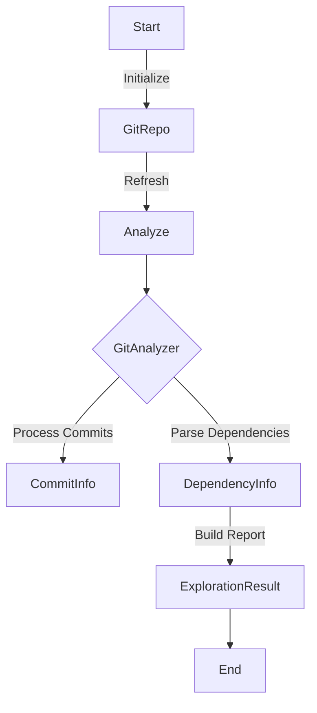

# Zap Git Analyzer Agents

## Quick Start

To use Zap Agents for analyzing Git repositories and managing tasks:

1. **Install Dependencies:**

   Ensure you have Python 3.11 or later. Then, install dependencies using Poetry:

   ```sh
   poetry install
   ```

2. **Run the Git Analyzer:**

   Analyze a Git repository:

   ```sh
   python -m zap.git_analyzer.analyze_repo
   ```

3. **Start the Main Application:**

   Start the Zap CLI:

   ```sh
   python zap/main.py
   ```

## Core Concepts

### GitAnalyzer Agent

The `GitAnalyzer` agent is the primary class for analyzing Git repositories, including checking the structure, dependencies, and commit history.

#### Example Usage

```python
from zap.git_analyzer import GitAnalyzer

async def analyze_git_repo(repo_path):
    analyzer = GitAnalyzer(path=repo_path)
    result = await analyzer.analyze()
    print(result)

import asyncio
asyncio.run(analyze_git_repo('/path/to/repo'))
```

### GitRepo Agent

The `GitRepo` agent is responsible for interfacing directly with Git repositories, providing functionalities such as refreshing repository data and checking file statuses.

#### Example

```python
from zap.git_analyzer.repo.git_repo import GitRepo

async def show_tracked_files(repo_path):
    repo = GitRepo(path=repo_path)
    files = await repo.get_tracked_files()
    print(files)

import asyncio
asyncio.run(show_tracked_files('/path/to/repo'))
```

## Examples and Use Cases

### Example: Git Repository File Status

Use `GitRepo` to get the status of files in a Git repository.

```python
import asyncio
from zap.git_analyzer.repo.git_repo import GitRepo

async def get_repo_status(repo_path):
    repo = GitRepo(path=repo_path)
    status = await repo.get_status()
    print(status)

asyncio.run(get_repo_status('/path/to/repo'))
```

### Example: Retrieve Recent Commits

Use `GitRepo` to retrieve the last 10 commits from a repository.

```python
import asyncio
from zap.git_analyzer.repo.git_repo import GitRepo

async def get_recent_commits(repo_path):
    repo = GitRepo(path=repo_path)
    commits = await repo.get_recent_commits(limit=10)
    for commit in commits:
        print(commit)

asyncio.run(get_recent_commits('/path/to/repo'))
```

### Example: Perform CLI Tasks

Run specific tasks via the CLI.

```sh
python zap/main.py --tasks "echo 'Hello, World!'"
```

or from a file:

```sh
python zap/main.py --tasks /path/to/tasks.txt
```

## Component Guide

### GitAnalyzer

High-level agent for repository analysis, providing a summary of structure, dependencies, and commit history.

#### Example

```python
from zap.git_analyzer import GitAnalyzer

async def analyze():
    analyzer = GitAnalyzer(path='/path/to/repo')
    result = await analyzer.analyze()
    print(result)

import asyncio
asyncio.run(analyze())
```

### GitRepo

Agent for direct interaction with Git repositories, providing file status checks, content retrieval, and commit history extraction.

#### Example

```python
from zap.git_analyzer.repo.git_repo import GitRepo

async def show_tracked_files(repo_path):
    repo = GitRepo(path=repo_path)
    files = await repo.get_tracked_files()
    print(files)

import asyncio
asyncio.run(show_tracked_files('/path/to/repo'))
```

## Configuration

Zap GitAnalyzer can be configured using various file formats such as JSON, YAML, or TOML, typically placed in `config.yaml`.

### Configuration Example

#### YAML Configuration File

```yaml
commit_limit: 20
log_level: DEBUG
```

#### Load Configuration

```python
from zap.git_analyzer.config import GitAnalyzerConfig

config = GitAnalyzerConfig.from_file('path/to/config.yaml')
analyzer = GitAnalyzer(config=config)
```

## Troubleshooting

### Common Issues

#### Issue: Path Does Not Exist

**Error Message:**

```plaintext
Path /invalid/path does not exist
```

**Solution:**

Ensure the provided path points to an existing directory.

#### Issue: Invalid Requirement Format

**Error Message:**

```plaintext
Invalid requirement format: xyz
```

**Solution:**

Check the formatting of your `requirements.txt` file. Each dependency should follow the format of `package==version`.

### Extending or Customizing Agents

You can extend Zap by creating custom agents or parsers.

#### Example: Custom Dependency Parser

```python
from zap.git_analyzer.parsers.base import DependencyParser
from zap.git_analyzer.models.dependency import DependencyInfo
from zap.git_analyzer.models.enums import Language, PackageManager

class MyCustomParser(DependencyParser):
    async def parse(self, content: str, file_path: str) -> DependencyInfo:
        # Custom parsing logic here
        dependencies = content.split()
        return DependencyInfo(language=Language.PYTHON, package_manager=PackageManager.PIP, dependencies=dependencies)

# Registering
from zap.git_analyzer.parsers.factory import ParserFactory
ParserFactory._parsers['.mydep'] = MyCustomParser
```

## Visualization: Git Analysis Flow

